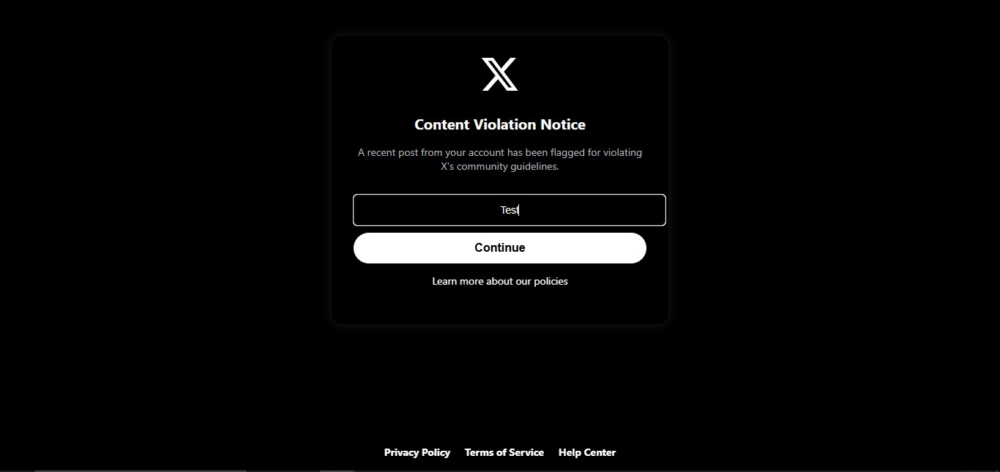
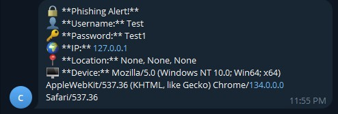

# Ethical Hacking Tool - ZCLOCK

## 📌 Overview
This project is an **ethical hacking and cybersecurity awareness tool** designed for academic research and educational purposes. It simulates a phishing attack to demonstrate the risks of credential theft and educate users about online security threats.

⚠️ **Disclaimer:** This tool is strictly for educational purposes and authorized security training. Unauthorized use of this tool is illegal and unethical.

## 🔧 Features
- **Flask Web Interface**: A user-friendly web application for interacting with the tool.
- **Telegram Integration**: Captured credentials and device info are securely sent to a Telegram bot.
- **Twitter API**: Retrieves user profile pictures and tweets for added realism.
- **IP Geolocation**: Uses an external API to fetch the user's approximate location.
- **User-Agent Tracking**: Captures browser and device information.

## 🛠️ Installation & Setup
### 1️⃣ Clone the Repository
```sh
 git clone https://github.com/yabuna/ZCLOCK
 cd ZCLOCK
```

### 2️⃣ Install Dependencies
Ensure you have Python installed, then run:
```sh
 pip install -r requirements.txt
```

### 3️⃣ Run the Application
```sh
python Tapp.py
```
The app will start on `https://127.0.0.1:5000/`.

## 📌 How It Works
1. Users enter their Twitter username.
2. The tool fetches their **profile picture and latest tweet**.
3. Users are prompted to log in (fake page for educational purposes).
4. Credentials and device details are logged and sent to **Telegram** for analysis.

## 🖼️ Screenshots





## 🛑 Ethical Considerations
This tool is meant for **academic use only** and should not be used for illegal activities. Ensure you have **explicit authorization** before deploying.

## 👨‍💻 Author
- **Y4BN**
- **[Your GitHub Profile](https://github.com/yabuna)**

## 📜 License
This project is licensed under the **MIT License**. Unauthorized use is strictly prohibited.

